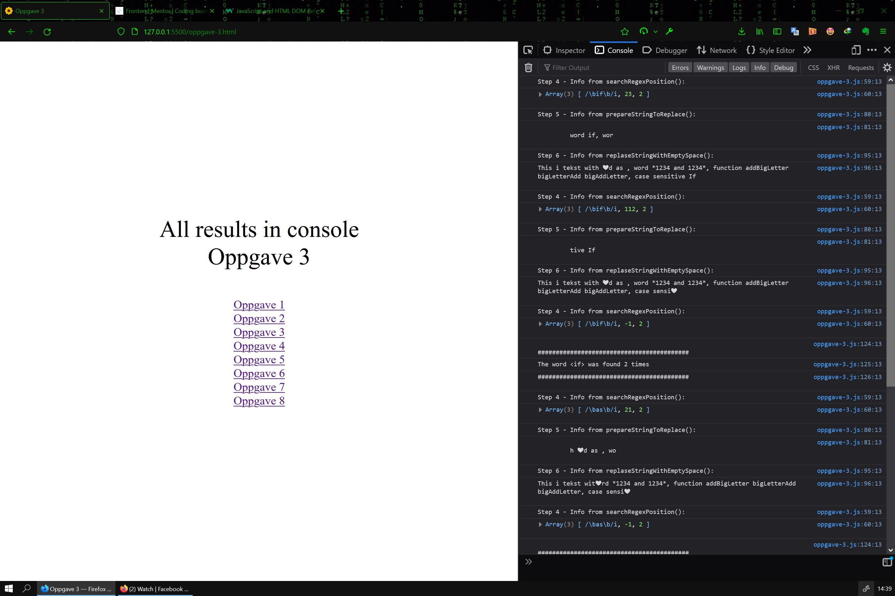

# JavaScript - Methodically looping

[Source code](https://github.com/chriskodehub/KH-11_javascript-methodically-looping)  
[Live demo](https://chriskodehub.github.io/KH-11_javascript-methodically-looping/)

## Oppgave

Bruk av methods og loops:  

1. sjekk om en lengre tekst du finner på nettet er over en wordcount (antall tegn) du velger selv.
2. lag en loop som teller til 10
3. finn ordene "if", "as", "and" i teksten du valgte og kutt ut de ordene pluss 5 tegn på hver side av ordene.
4. sett sammen de nye stringene dine.
5. bytt ut de ordene med norske ord.
6. lag et lite spill hvor spilleren har 3 liv. Hint: while loops
7. lag en array med 10 ord og en med 10 tall.
8. sett alle tallene utenom det første og siste til å være det samme tallet et tall om gangen

## Result

